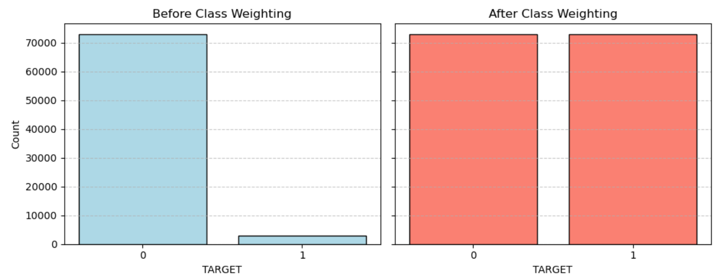

  

# Santander Customer Satisfaction

This repository contains an attempt to predict customer satisfaction for Santander Bank using data from the [Santander Customer Satisfaction Kaggle Challenge](https://www.kaggle.com/competitions/santander-customer-satisfaction/overview).

## Overview

The objective of the Kaggle challenge is to predict customer dissatisfaction using anonymized numerical features representing customer behavior. The dataset consists of more than 76,000 customer records and a binary target variable indicating satisfaction. The task was approached as a **binary classification problem**. Data preprocessing, exploration, and cleaning were conducted, followed by training and evaluation of machine learning model, **Random Forests, and XGBoost**. The imbalance in the dataset was addressed through class weighting. Feature selection techniques were applied to enhance generalization. The best performance was achieved using an XGBoost model with an accuracy of 96 percentage and a AUC-score of 0.81. At this time, the highest AUC-score on Kaggle Subnission is 0.82.

## Summary of Workdone

### Data

- **Input**: CSV file with 370 anonymized numerical features and a binary target variable.
- **Dataset Size**: Approximately 76,000 training instances.
- **Train/Test Split**: A stratified 80/20 split was applied.
  
### Preprocessing:
  - Constant and duplicate columns were removed.
  - Class imbalance was identified and addressed using class weights.

### Data Visualization

To better understand the dataset and model performance, I visualized key aspects of the data and results:

---

#### Feature Distributions

I began by examining the distributions of all features. Below is a sample of two representative features:

  
*Feature 1 Distribution*

  
*Feature 2 Distribution*

> These distributions are typical of other features in the dataset, most of which are numeric and centered around 0 with varying spread. No major outliers were found, but feature selection remain important for optimal model performance.

---

#### Class Imbalance & Balancing

The target variable (`satisfaction`) was significantly imbalanced, with a large majority of samples labeled as satisfied customers. This imbalance can bias the model toward predicting the dominant class.

**Before balancing:**

  
*Highly imbalanced data — majority of customers are labeled satisfied (0)*

To address this, we evaluated multiple balancing techniques, including SMOTE, undersampling, and class weighting. After testing different models on each approach, the results showed that **class weighting** yielded better overall performance on validation metrics compared to oversampling methods.

**Model Comparison of Balancing Techniques:**

  
Based on the evaluation metrics, Class Weighted sampling emerges as the most suitable approach for this task. While the baseline model showed the highest ROC-AUC, it performed extremely poorly in identifying dissatisfied customers, with a recall close to 1% and an F1-score near zero.  

Among the resampling techniques:  

+ Undersampling had the highest recall (77.2%) but the lowest precision (11%), leading to too many false positives.  

+ SMOTE achieved the best F1-score (0.2516), but its lower recall (38.9%) means it missed many actual dissatisfied customers.  

+ Class Weighted stood out by offering a strong balance:  

  + Recall: 65.8%

  + Precision: 14.9%

  + F1-score: 0.2436

*Given these results, class weighting is the most reliable method, effectively identifying dissatisfied customers while keeping false positives within a reasonable range.*    

**After balancing:**

  
*Balanced class distribution after applying Class weighting Method*

> Balancing the dataset improved recall for the minority class, ensuring the model is not biased toward predicting only satisfied customers.

---

#### ROC Curve Comparison

To evaluate the performance of the models (Random Forest and XGBoost), their ROC curves are:

  
*ROC curves for both models — XGBoost outperforms Random Forest in AUC*

> The ROC curves show that XGBoost achieves a slightly better true positive rate at most thresholds, confirming its strength for this binary classification task.

## Problem Formulation

- **Input**: anonymized numerical features.
- **Output**: Binary prediction (0 = satisfied, 1 = dissatisfied).

### Models

The following models were developed and evaluated:

- Random Forest
- XGBoost Classifier

Theese models are generally used for the classification problems and as this was a classification problem too, I decided to train on theese models.

Evaluation metrics included `accuracy`, `log loss`, `precision`, `recall`, and `ROC-AUC`.

##  Training

- **Environment**: Python 3.11, Jupyter Notebook.
- **Libraries**: Scikit-learn, XGBoost, Pandas, Numpy, Tabulate
- **Challenges**:
  - Class imbalance  
    There was very high class imbalance. This was handled by comparing evaluation metrics (accuracy, log loss, precision,  recall, and ROC-AUC) of the different models like SMOTE, Oversampling, Baseline, Class-weights and undersampling. These gave the conlusion that best result is when the class imbalance is handled with class weighting.
  - Redundant features were filtered out looking at the duplicated in feaatures and constant data in the features.

## Performance Comparison

| Model              | Accuracy | Log Loss | ROC-AUC |
|-------------------|----------|----------|---------|
| Random Forest       | 0.9551     | 0.3330     | 0.7629    |
| XGBoost             | 0.9607     | 0.1410     | 0.8110    |

Performance metrics show that XGBoost consistently outperformed the random Forest Model in accuracy and log loss.

##  Conclusions

XGBoost was found to be the most effective model for this classification task. Its ability to capture non-linear relationships and handle class imbalance contributed to superior performance. 

## How to reproduce results
To reproduce the results:

1. Download the dataset from the [Santander Customer Satisfaction Kaggle Challenge](https://www.kaggle.com/competitions/santander-customer-satisfaction/data).
2. Save all three downloaded files into `Kaggle` folder in project root directory.
3. Install all required libraries and modules as described in the [`Software Setup`](#software-setup) section.
4. Run the notebook [`DataCleaning.ipynb`](DataCleaning.ipynb) to preprocess and clean the data.
5.  Execute [`DataVisualization.ipynb`](DataVisualization.ipynb) to see visualizations
6. Run the notebook [`MachineLearning.ipynb`](MachineLearning.ipynb) to train models and evaluate results.
---
   
## Future Work

- Application of advanced resampling techniques.
- Application of Feature importance for better results.
- Exploration of deep learning models.

## Overview of Files and Folders in Repository

- [README.md](README.md): A general overview of the project, including background, methodology, and results.
- [DataCleaning.ipynb](DataCleaning.ipynb): Data loading, preprocessing, and cleaning are performed in this notebook. Constant and duplicate features are removed, and class imbalance is addressed.
- [MachineLearning.ipynb](MachineLearning.ipynb): Random Forest and XGBoost models are trained, evaluated, and applied to the test dataset.
- [DataVisualization.ipynb](DataVisualization.ipynb): Exploratory data analysis is conducted through feature histograms. 

---

## Software Setup

The project was developed using Python 3.10+. The following packages are required for successful execution of the notebooks:

- `numpy`
- `pandas`
- `matplotlib`
- `seaborn`
- `scikit-learn`
- `xgboost`
- `jupyter`

